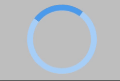

# sass-loading-spinner

[](https://badge.fury.io/js/sass-loading-spinner)



A css only, and sass importable, loading spinner. Been using this for years, and was inspired by an awesome stack overflow answer I could not find again. The project follows BEM naming conventions.

[Github Pages Demo](https://torch2424.github.io/sass-loading-spinner/).
[NPM Module Link](https://www.npmjs.com/package/sass-loading-spinner).

## Usage

Install to the project:

```
npm install --save sass-loading-spinner
```

Simply import at the top of a sass file to get going:

```scss
@import './node_modules/sass-loading-spinner/index.scss';

// Other Sass down here...
```

## Example

Please see the [docs](./docs) folder for a very simple example project that is on the [Github Pages](https://torch2424.github.io/sass-loading-spinner/).

Here is how the body should be set up to use the loading spinner. I would show each of the elements when determining your "loading" state. Each of these classes can be used independently of one another.

```html
<body>

  <!-- Overlay for loading spinner -->
  <div class="sass-loading-spinner__dark-overlay">
  </div>

  <!-- Centered Modal for the loading spinner -->
  <div class="sass-loading-spinner__modal">

    <!-- Title for the Modal -->
    <h1 class="sass-loading-spinner__title">
    </h1>

    <!-- Anything can be placed inside the modal -->

    <!-- The loading spinner itself -->
    <div class="sass-loading-spinner__spinner">
    </div>
  </div>

  <!-- App container element. If you don't have a container, I suggest moving everything in your <body>, into a container that way you can hide it when the loading state occurs. Also, please note, that the sass-loading-spinner__no-click class and aria-hidden attribute should be applied when loading starts, and removed when loading ends. -->
  <main class="whatever-your-container-class-is sass-loading-spinner__no-click" aria-hidden>
  </main>
</body>
```

If you would like to change the base color of the spinner, you can use the $spinner variable:

```sass
$spinner: #FF4A4A
```

## Contributing

Clone the project:

```
git clone https://github.com/torch2424/sass-loading-spinner.git
```

Install devDependencies:

```
npm install
```

Run the command: `npm run build`, to continuously see changes to the `index.html` in the `docs` folder. Sorry, but no livereload or watch is set up for this (Since it's just a simple little package).

## LICENSE

[MIT](https://choosealicense.com/licenses/mit/#)
